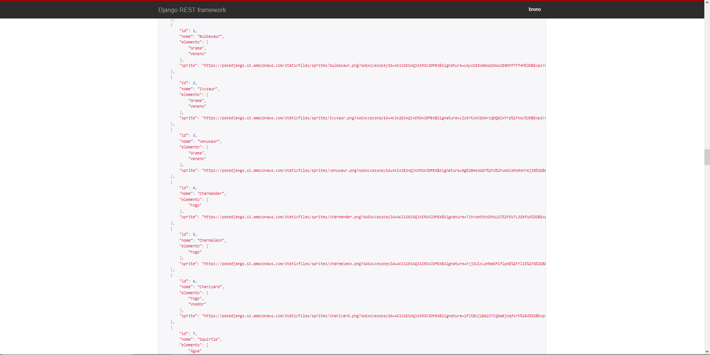

## PokéDjango!
<p align="center" style="display: flex; align-items: flex-start; justify-content: right;">


---
Api que contém os 151 pokémons da primeira geração feita usando django rest framework para estudo da ferramenta.


Caso queira fazer o clone do projeto e ter acesso ao banco de dados é bem fácil! :D

Utilize o comando
``https://github.com/breeeno/pokedjango.git`` 
e clone o projeto.

Em seguida, isole o ambiente virtual:

1 - Navegue para o diretório:

``cd pokedjango``

2 - Crie seu ambiente virtual:

```python -m venv .venv```

3 - Ative-o:

``.venv/Scripts/activate.bat``

4 - Instale as dependências:

``pip install -r requirements.txt``

``pip install -r requirements-dev.txt``

5 - Em seguida, use o comando para carregar o banco de dados:

``python manage.py loaddata pokemon.json`` 

E pronto! Você já está hábil a ter acesso a todas as funções e todo o código da aplicação!

---
Dentro da aplicação, você pode fazer o cadastro dos pokémons através do admin do django:

Para isso, você deve criar um superuser com o comando:
``python manage.py createsuperuser``

Em seguida, passe as credenciais que você quiser usar, e você terá um superuser para visualização do admin do django.


Visualização e edição de pokémons:
<p align="center" style="display: flex; align-items: flex-start; justify-content: center;">
  
  

</p>
Você também pode visualizar os pokémons através da API root do projeto:
<p align="center" style="display: flex; align-items: flex-start; justify-content:center;">
  
</p>

---

Caso queira colaborar com o projeto:

1 - Faça um fork do projeto.

2 - Crie uma nova branch com as suas alterações: 

``git checkout -b my-feature``

3 - Salve as alterações e crie uma mensagem de commit contando o que você fez: 

``git commit -m "feature: My new feature"``

4 - Envie as suas alterações: 

``git push origin my-feature``

---
Feito com muito carinho por  <a href="https://www.linkedin.com/in/breno-eustáquio/">Breno Eustáquio</a> &#128013;

---
Visualização da api disponível em:
https://pokemondjango.herokuapp.com

